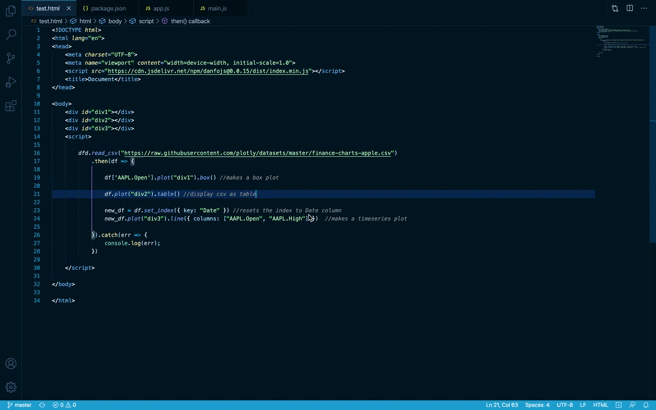
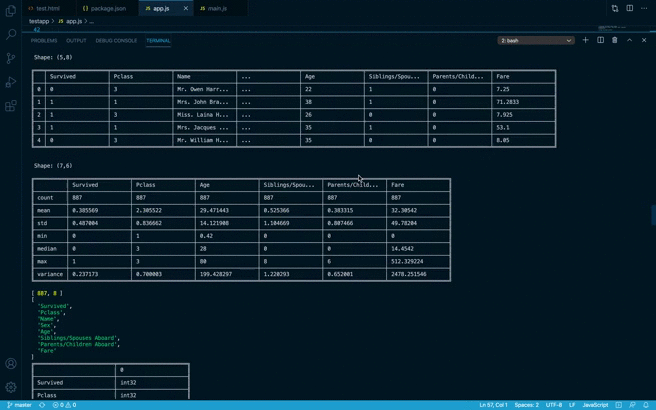

<div align="center">
  <br>
</div>

-----------------

## danfojs: powerful javascript data analysis toolkit 

[](https://www.jsdelivr.com/package/npm/danfojs)
[](https://travis-ci.org/opensource9ja/danfojs)
[](https://coveralls.io/github/opensource9ja/danfojs)
 
<span class="badge-patreon"><a href="https://www.patreon.com/bePatron?u=40496758" title="Donate to this project using Patreon"></a></span>


## What is it?

**danfo.js** is a javascript package that provides fast, flexible, and expressive data
structures designed to make working with "relational" or "labeled" data both
easy and intuitive. It is heavily inspired by [Pandas](https://pandas.pydata.org/pandas-docs/stable/) library, and provides a similar API. This means that users familiar with [Pandas](https://pandas.pydata.org/pandas-docs/stable/), can easily pick up danfo.js. 

## Main Features

  - Danfo.js is fast. It is built on Tensorflow.js, and supports tensors out of the box. This means you can [convert Danfo data structure](https://danfo.jsdata.org/api-reference/dataframe/dataframe.tensor) to Tensors.
  - Easy handling of [missing-data](https://danfo.jsdata.org/getting-started#missing-data) (represented as
    `NaN`) in floating point as well as non-floating point data
  - Size mutability: columns can be [inserted/deleted](https://danfo.jsdata.org/api-reference/dataframe#combining-comparing-joining-merging) from DataFrame
  - Automatic and explicit [alignment](https://danfo.jsdata.org/api-reference/dataframe#reindexing-selection-label-manipulation): objects can
    be explicitly aligned to a set of labels, or the user can simply
    ignore the labels and let `Series`, `DataFrame`, etc. automatically
    align the data for you in computations
  - Powerful, flexible [groupby](https://danfo.jsdata.org/api-reference/groupby) functionality to perform
    split-apply-combine operations on data sets, for both aggregating
    and transforming data
  - Make it easy to convert Arrays, JSONs, List or Objects, Tensors and 
    differently-indexed data structures
    into DataFrame objects
  - Intelligent label-based [slicing](https://danfo.jsdata.org/api-reference/dataframe/danfo.dataframe.loc), [fancy indexing](https://danfo.jsdata.org/api-reference/dataframe/danfo.dataframe.iloc), and [querying](https://danfo.jsdata.org/api-reference/dataframe/danfo.dataframe.query) of
    large data sets
  - Intuitive [merging](https://danfo.jsdata.org/api-reference/general-functions/danfo.merge) and [joining](https://danfo.jsdata.org/api-reference/general-functions/danfo.concat) data
    sets
  - Robust IO tools for loading data from [flat-files](https://danfo.jsdata.org/api-reference/input-output)
    (CSV and delimited).
  - Powerful, flexible and intutive API for [plotting](https://danfo.jsdata.org/api-reference/plotting) DataFrames and Series interactively.
  - [Timeseries](https://danfo.jsdata.org/api-reference/series#accessors)-specific functionality: date range
    generation and date and time properties. 
  - Robust data preprocessing functions like [OneHotEncoders](https://danfo.jsdata.org/api-reference/general-functions/danfo.onehotencoder), [LabelEncoders](https://danfo.jsdata.org/api-reference/general-functions/danfo.labelencoder), and scalers like [StandardScaler](https://danfo.jsdata.org/api-reference/general-functions/danfo.standardscaler) and [MinMaxScaler](https://danfo.jsdata.org/api-reference/general-functions/danfo.minmaxscaler) are supported on DataFrame and Series


To use danfo.js via script tags, copy and paste the CDN below to your HTML file

```html
  <script src="https://cdn.jsdelivr.net/npm/danfojs@0.1.2/dist/index.min.js"></script>
```

### Example Usage in the Browser

```html

<!DOCTYPE html>
<html lang="en">
<head>
    <meta charset="UTF-8">
    <meta name="viewport" content="width=device-width, initial-scale=1.0">
    <script src="https://cdn.jsdelivr.net/npm/danfojs@0.1.2/dist/index.min.js"></script>
    <title>Document</title>
</head>

<body>

    <div id="div1"></div>
    <div id="div2"></div>
    <div id="div3"></div>

    <script>

        dfd.read_csv("https://raw.githubusercontent.com/plotly/datasets/master/finance-charts-apple.csv")
            .then(df => {

                df['AAPL.Open'].plot("div1").box() //makes a box plot

                df.plot("div2").table() //display csv as table

                new_df = df.set_index({ key: "Date" }) //resets the index to Date column
                new_df.plot("div3").line({ columns: ["AAPL.Open", "AAPL.High"] })  //makes a timeseries plot

            }).catch(err => {
                console.log(err);
            })

    </script>
    
</body>

</html>
```

Output in Browser:




## How to install
danfo.js is hosted on NPM, and can installed via package managers like npm and yarn

```sh
npm install danfojs-node
```

### Example usage in Nodejs

```javascript

const dfd = require("danfojs-node")


dfd.read_csv("https://web.stanford.edu/class/archive/cs/cs109/cs109.1166/stuff/titanic.csv")
  .then(df => {
    //prints the first five columns
    df.head().print()

    //Calculate descriptive statistics for all numerical columns
    df.describe().print()

    //prints the shape of the data
    console.log(df.shape);

    //prints all column names
    console.log(df.column_names);

    //prints the inferred dtypes of each column
    df.ctypes.print()

    //selecting a column by subsetting
    df['Name'].print()

    //drop columns by names
    cols_2_remove = ['Age', 'Pclass']
    df_drop = df.drop({ columns: cols_2_remove, axis: 1 })
    df_drop.print()


    //select columns by dtypes
    let str_cols = df_drop.select_dtypes(["string"])
    let num_cols = df_drop.select_dtypes(["int32", "float32"])
    str_cols.print()
    num_cols.print()


    //add new column to Dataframe
    let new_vals = df['Fare'].round().values
    df_drop.addColumn({ column: "fare_round", value:  new_vals})
    df_drop.print()

    df_drop['fare_round'].print(5)

    //prints the number of occurence each value in the column
    df_drop['Survived'].value_counts().print()

    //print the last ten elementa of a DataFrame
    df_drop.tail(10).print()

    //prints the number of missing values in a DataFrame
    df_drop.isna().sum().print()

  }).catch(err => {
    console.log(err);
  })

```
Output in Node Console:



#### You can play with Danfo.js on Dnotebooks playground [here](https://playnotebook.jsdata.org/demo)

#### [See the Official Getting Started Guide](https://danfo.jsdata.org/getting-started)

## Documentation
The official documentation can be found [here](https://danfo.jsdata.org)

## Discussion and Development
Development discussions take place on our [issues](https://github.com/opensource9ja/danfojs/issues) tab. 

## Contributing to Danfo
All contributions, bug reports, bug fixes, documentation improvements, enhancements, and ideas are welcome. A detailed overview on how to contribute can be found in the [contributing guide](https://danfo.jsdata.org/contributing-guide).

#### Licence [MIT](https://github.com/opensource9ja/danfojs/blob/master/LICENCE)

#### Created by [Rising Odegua](https://github.com/risenW) and [Stephen Oni](https://github.com/steveoni)

<a href="https://www.producthunt.com/posts/danfo-js?utm_source=badge-featured&utm_medium=badge&utm_souce=badge-danfo-js" target="_blank"></a>
